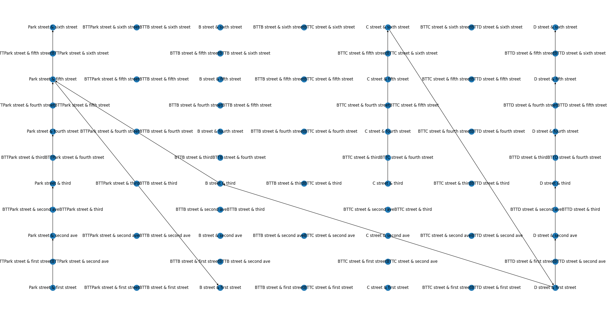

# How to run
``` 
pip install -r requirements.txt
python transit_utilities.py  > tmp.ni
```


then make sure you have 

Version 6 of Transit System by Emily Short.

 you are good to go

# Code Description
My code is pretty messy, there is a fair amount of "functionality" (whatever that means) here 

Some things my code can do
- convert a networkX graph into a playable inform map with multiple modes of transit
- take 2 lists of streets and generate a city grid, with additional transit modes possible (using networkx this also allows )
- take *some* trimet busses and make them rideable in inform with accurate transit times (this is one of the buggiest since I am the world laziest web scraper)
This also outputs a simple plot of the intersections and the bus routes 

It might not look the same since some of the routes are random (I think this is actually how trimet plans their routes too)